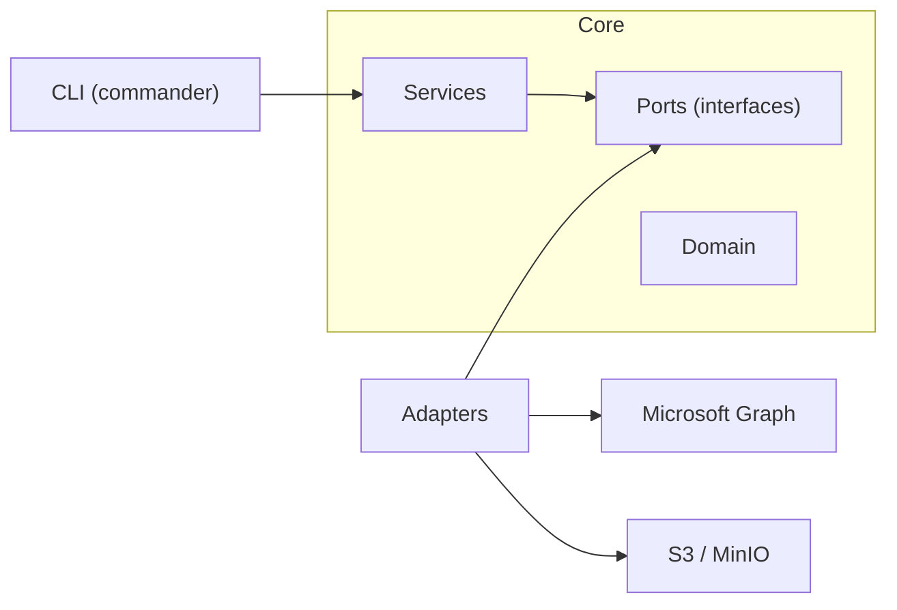

# m365-atlas

CLI tool for backing up Microsoft 365 mailboxes to S3-compatible object storage with per-tenant encryption, content-addressed deduplication, and delta sync.

## Highlights

- **Per-tenant envelope encryption** -- each tenant gets its own AES-256-GCM data encryption key (DEK), derived and wrapped via scrypt. A database breach exposes only encrypted blobs; each tenant's data requires its own master passphrase to decrypt. Most backup tools encrypt at the volume level or not at all.
- **Content-addressed deduplication** -- messages are stored under `SHA-256(plaintext)` keys, scoped per-mailbox. Identical content across folders or backup runs within a mailbox is stored once. Dedup happens before encryption, so ciphertext variance doesn't defeat it.
- **Multi-layer integrity** -- plaintext SHA-256 checksums in the manifest, `Content-MD5` on every S3 PUT for transport verification, and AES-GCM authentication tags for at-rest tamper detection. `atlas verify` re-derives all three.
- **Delta sync with stale-delta safeguard** -- uses Microsoft Graph delta queries for incremental backups. Detects interrupted prior runs (saved delta link + zero manifest entries) and automatically falls back to full enumeration. `--full` flag available to force it.
- **Hexagonal architecture** -- ports-and-adapters with Inversify DI. Swap the storage backend or mail connector without touching business logic. Every service is independently testable.
- **TypeScript / Node.js** -- installable via npm, no compiled binary distribution needed. Runs anywhere Node 20+ does.

## Architecture



```
src/
├── adapters/
│   ├── keystore/          # envelope encryption (AES-256-GCM, scrypt KEK)
│   ├── m365/              # Microsoft Graph connector (delta sync, OAuth2)
│   ├── storage-s3/        # S3 object storage, manifest repo, bucket manager
│   └── tenant-context.factory.ts
├── cli/
│   └── commands/          # backup, list, read, verify, restore, delete
├── domain/                # Manifest, Snapshot, Tenant, BackupObject (pure data)
├── ports/                 # ObjectStorage, MailboxConnector, ManifestRepository, KeyService
├── services/              # MailboxSyncService, CatalogService, DeletionService, etc.
└── utils/                 # config loader, logger
```

## Quick start

```bash
# install
npm install -g m365-atlas

# start MinIO (or use any S3-compatible endpoint)
cd docker && docker compose up -d

# configure
cp .env.example .env
# fill in tenant_id, client_id, client_secret, s3 credentials, encryption passphrase

# first backup
atlas backup --mailbox user@company.com
```

## Configuration

Atlas loads configuration from three sources, merged in this order (later wins):

1. Config file: `atlas.config.json` or `.atlas/config.json` (searched in cwd, then `~/.atlas/`)
2. `.env` file (loaded via dotenv, does not overwrite existing env vars)
3. Environment variables (always win)

| Variable | Config field | Required | Description |
|---|---|---|---|
| `ATLAS_TENANT_ID` | `tenant_id` | yes | Azure AD tenant ID |
| `ATLAS_CLIENT_ID` | `client_id` | yes | App registration client ID |
| `ATLAS_CLIENT_SECRET` | `client_secret` | yes | App registration client secret |
| `ATLAS_S3_ENDPOINT` | `s3_endpoint` | yes | S3 endpoint URL (e.g. `http://localhost:9002`) |
| `ATLAS_S3_ACCESS_KEY` | `s3_access_key` | yes | S3 access key |
| `ATLAS_S3_SECRET_KEY` | `s3_secret_key` | yes | S3 secret key |
| `ATLAS_S3_REGION` | `s3_region` | no | S3 region (default: `us-east-1`) |
| `ATLAS_ENCRYPTION_PASSPHRASE` | `encryption_passphrase` | yes | Master passphrase for envelope encryption |

## Azure AD setup

Register an application in Azure Portal with these **Application** permissions (not Delegated):

| Permission | Why |
|---|---|
| `Mail.Read` | Read mailbox contents via Graph API |
| `User.Read.All` | Enumerate users / resolve mailbox IDs |
| `MailboxSettings.Read` | Read mailbox metadata and folder structure |

After adding permissions, click **Grant admin consent for [your tenant]** in the API Permissions blade. The app authenticates using OAuth2 Client Credentials flow (`@azure/identity` `ClientSecretCredential`).

## CLI reference

### `atlas backup`

Back up mailboxes from M365 tenant to object storage.

```bash
atlas backup --mailbox user@company.com              # single mailbox
atlas backup --mailbox user@company.com --full        # force full sync (ignore delta state)
atlas backup --mailbox user@company.com -f Inbox Sent # specific folders only
atlas backup -t <tenant-id> -m user@company.com       # explicit tenant
```

| Option | Description |
|---|---|
| `-m, --mailbox <id>` | Mailbox to back up |
| `-f, --folder <name...>` | Filter to specific folder(s) by display name |
| `--full` | Ignore saved delta links, run full enumeration |
| `-t, --tenant <id>` | Override tenant ID from config |

### `atlas list`

Browse backed-up data at three zoom levels.

```bash
atlas list                          # all mailboxes with summary stats
atlas list -m user@company.com      # all snapshots for a mailbox
atlas list -s <snapshot-id>         # messages inside a snapshot (first 50)
atlas list -s <snapshot-id> --all   # all messages
```

| Option | Description |
|---|---|
| `-m, --mailbox <email>` | Show snapshots for this mailbox |
| `-s, --snapshot <id>` | Show messages inside this snapshot |
| `--all` | Show all messages (default caps at 50) |
| `-t, --tenant <id>` | Override tenant ID |

### `atlas read`

Decrypt and display a single backed-up message.

```bash
atlas read -s <snapshot-id> --message <message-id>        # formatted view
atlas read -s <snapshot-id> --message <message-id> --raw   # full JSON
```

| Option | Description |
|---|---|
| `-s, --snapshot <id>` | Snapshot containing the message |
| `--message <id>` | Graph API message ID |
| `--raw` | Output full JSON blob instead of formatted headers + body |
| `-t, --tenant <id>` | Override tenant ID |

### `atlas verify`

Verify integrity of a backup snapshot. Downloads every object, decrypts, recomputes SHA-256, and compares against the manifest checksum.

```bash
atlas verify -s <snapshot-id>
```

### `atlas restore`

> **Work in progress.** The restore command currently decrypts and validates all objects in a snapshot but does not yet push messages back to a mailbox via Graph API.

```bash
atlas restore -s <snapshot-id>
atlas restore -s <snapshot-id> -m target@company.com   # restore to different mailbox
```

### `atlas delete`

Delete backed-up data with confirmation prompt.

```bash
atlas delete -m user@company.com        # delete all data + manifests for a mailbox
atlas delete -s <snapshot-id>           # delete one snapshot manifest (data objects retained)
atlas delete --purge                    # delete EVERYTHING in the tenant bucket
atlas delete --purge -y                 # skip confirmation prompt
```

| Option | Description |
|---|---|
| `-m, --mailbox <email>` | Delete all data and manifests for a mailbox |
| `-s, --snapshot <id>` | Delete a single snapshot manifest |
| `--purge` | Delete all data, manifests, and encryption keys (irreversible) |
| `-y, --yes` | Skip confirmation prompt |
| `-t, --tenant <id>` | Override tenant ID |

## Security model

Atlas uses envelope encryption to isolate tenants cryptographically:

```
Master passphrase (env var)
    |
    v
scrypt(passphrase, tenant_id, N=16384, r=8, p=1)  -->  KEK (256-bit, per-tenant)
    |
    v
KEK wraps/unwraps a random DEK (AES-256-GCM)
    |
    v
DEK encrypts all data + manifests for that tenant
```

- **KEK** (Key Encryption Key) -- derived deterministically from the passphrase and tenant ID. Never stored; re-derived on every run.
- **DEK** (Data Encryption Key) -- random 256-bit key, generated once per tenant and stored wrapped (encrypted with KEK) at `_meta/dek.enc` in the tenant's S3 bucket.
- **Ciphertext format** -- `[12-byte IV][16-byte GCM auth tag][ciphertext]`. Every encrypt operation uses a fresh random IV.

Integrity is validated at three layers:

| Layer | Mechanism | When |
|---|---|---|
| Plaintext | SHA-256 checksum stored in manifest | Backup, verify, restore |
| Transport | `Content-MD5` header on S3 PUT | Upload (S3 rejects mismatches) |
| At-rest | AES-256-GCM authentication tag | Every decrypt (tamper = exception) |

## Delta sync

Backups use Microsoft Graph [delta queries](https://learn.microsoft.com/en-us/graph/delta-query-messages) for incremental sync:

1. **Initial run** -- requests `/users/{id}/mailFolders/{id}/messages/delta` with `$select` including `body`. The API returns all messages across paginated responses. The final `@odata.deltaLink` is saved in the manifest.
2. **Subsequent runs** -- sends the saved `deltaLink`. The API returns only messages created, modified, or deleted since the last sync.
3. **Stale-delta safeguard** -- if a saved delta link returns 0 items but the previous manifest had 0 entries (indicating an interrupted prior backup), Atlas discards the link and runs a full enumeration automatically.
4. **Force full** -- `atlas backup --full` ignores all saved delta links.

Message bodies are fetched inline via the delta `$select` parameter, avoiding per-message API calls. The Graph SDK's built-in retry middleware handles 429 (throttle) and 5xx responses.

## Storage layout

Each tenant gets its own S3 bucket named `atlas-{tenant_id}`:

```
atlas-{tenant_id}/
├── _meta/
│   └── dek.enc                         # wrapped DEK (encrypted with KEK)
├── data/
│   └── {mailbox_id}/
│       ├── {sha256_a}                  # encrypted message (content-addressed)
│       ├── {sha256_b}
│       └── ...
└── manifests/
    └── {mailbox_id}/
        ├── {snapshot_id_1}.json        # encrypted manifest
        └── {snapshot_id_2}.json
```

- **Content-addressed keys** -- `data/{mailbox}/{SHA-256 of plaintext}`. Deduplication is per-mailbox; identical messages across snapshots of the same mailbox are stored once.
- **Manifests** -- JSON containing snapshot metadata, per-message checksums, sizes, storage keys, and delta links for the next incremental sync.

## Development

```bash
pnpm install
pnpm run build          # bundle with tsdown
pnpm run test           # vitest (unit tests)
pnpm run test:coverage  # with v8 coverage
pnpm run lint           # eslint
pnpm run format         # prettier
```

### Code conventions

| Rule | Enforced by |
|---|---|
| `kebab-case` file names | `eslint-plugin-check-file` |
| `snake_case` variables, parameters, properties | `@typescript-eslint/naming-convention` |
| `PascalCase` types, classes, interfaces | `@typescript-eslint/naming-convention` |
| Max 300 lines per file (excluding blanks/comments) | `max-lines` ESLint rule |
| Single quotes, trailing commas, 100-char print width | Prettier |

### Testing

Tests use Vitest with `@vitest/coverage-v8`. Services are tested via Inversify container wiring with mock adapters -- no network calls in unit tests. The same DI tokens used in production are bound to mock implementations.

## License

ISC
