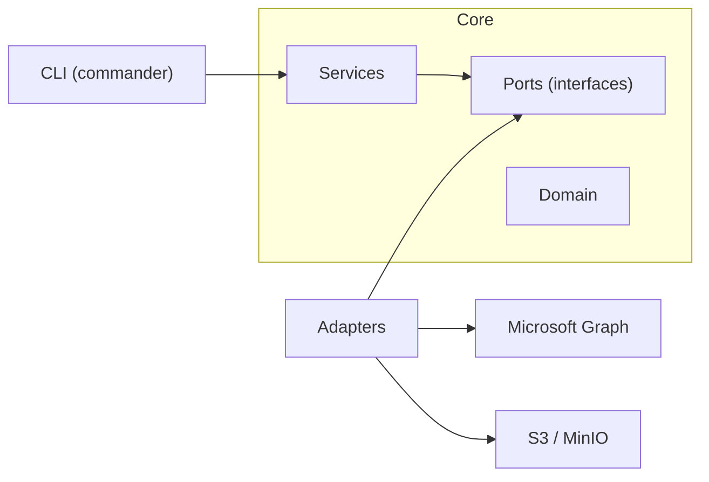

# m365-atlas

[](https://github.com/miikaok/atlas/actions/workflows/ci.yml)
[](https://github.com/miikaok/atlas/actions/workflows/ci.yml)
[](https://www.npmjs.com/package/m365-atlas)
[](./LICENSE)

An open-source CLI backup and restore engine for Microsoft 365 mailboxes. Built with per-tenant envelope encryption, content-addressed deduplication, multi-layer integrity validation, and efficient delta synchronization for scalable, secure operations against S3-compatible object storage.

## Highlights

- **Per-tenant envelope encryption** -- each tenant gets its own AES-256-GCM data encryption key (DEK), derived and wrapped via scrypt. A storage breach exposes only encrypted blobs; each tenant's data requires its own master passphrase to decrypt. Most backup tools encrypt at the volume level or not at all.
- **Storage-enforced immutability (Object Lock / WORM)** -- Atlas applies time-based Object Lock retention on S3/MinIO writes. Enforcement is done by the storage backend, not by application metadata. Atlas also stores requested/effective lock policy in manifests for audit and reconciliation.
- **Content-addressed deduplication** -- messages and attachments are stored under `SHA-256(plaintext)` keys, scoped per-mailbox. Identical content across folders or backup runs within a mailbox is stored once. The same PDF attached to 50 emails is stored once. Dedup happens before encryption, so ciphertext variance doesn't defeat it.
- **Attachment backup and restore** -- file attachments are fetched via the Graph API, deduplicated independently of their parent message, and stored encrypted alongside message data. Large attachments (>3 MB) use Graph upload sessions with chunked transfer during restore. Attachments over ~4 MB that Graph cannot inline during backup are recorded as metadata-only with a warning.
- **Full restore with original timestamps** -- restored messages retain their original `receivedDateTime` and `sentDateTime` via MAPI extended properties, appear as received mail (not drafts), and are placed into a timestamped `Restore-<date>` folder preserving the original subfolder structure. Supports snapshot-level, folder-level, single-message, and cross-mailbox restores.
- **Multi-layer integrity** -- plaintext SHA-256 checksums in the manifest, `Content-MD5` on every S3 PUT for transport verification, and AES-GCM authentication tags for at-rest tamper detection. `atlas verify` re-derives all three.
- **Delta sync with stale-delta safeguard** -- uses Microsoft Graph delta queries for incremental backups. Detects interrupted prior runs (saved delta link + zero manifest entries) and automatically falls back to full enumeration. `--full` flag available to force it.
- **Graceful interruption** -- Ctrl+C during a backup saves a partial manifest with already-stored objects and merges delta links so the next run resumes where it left off rather than starting over.
- **Real-time progress dashboard** -- multi-line ANSI dashboard during backup and restore shows all folders simultaneously with per-folder and global ETA, items/s rate, and distinct states for active, completed, empty, synced (delta), and interrupted folders.
- **Data protection by default** -- email subjects are hidden in `atlas list` output unless explicitly revealed with `-S`, preventing accidental exposure of confidential information during admin operations.
- **Hexagonal architecture** -- ports-and-adapters with Inversify DI. Swap the storage backend or mail connector without touching business logic. Every service is independently testable.
- **TypeScript / Node.js** -- installable via npm, no compiled binary distribution needed. Runs anywhere Node 20+ does.

## Architecture



```
src/
├── adapters/
│   ├── keystore/          # envelope encryption (AES-256-GCM, scrypt KEK)
│   ├── m365/              # Microsoft Graph connector (delta sync, OAuth2, restore)
│   ├── storage-s3/        # S3 object storage, manifest repo, bucket manager
│   └── tenant-context.factory.ts
├── cli/
│   └── commands/          # backup, list, read, verify, restore, delete
├── domain/                # Manifest, Snapshot, Tenant, BackupObject (pure data)
├── ports/                 # ObjectStorage, MailboxConnector, RestoreConnector, ManifestRepository, KeyService
├── services/              # MailboxSyncService, RestoreService, CatalogService, DeletionService, helpers
└── utils/                 # config loader, logger
```

## Quick start

```bash
# install
npm install -g m365-atlas

# start MinIO (or use any S3-compatible endpoint)
cd docker && docker compose up -d

# configure
cp .env.example .env
# fill in tenant_id, client_id, client_secret, s3 credentials, encryption passphrase

# first backup
atlas backup --mailbox user@company.com

# optional: check immutable backup readiness first
atlas storage-check --lock-mode governance --retention-days 30

# immutable backup (governance retention)
atlas backup --mailbox user@company.com --retention-days 30 --lock-mode governance

# list what was backed up
atlas list

# restore a folder from backup
atlas restore -m user@company.com -f Inbox
```

## Configuration

Atlas loads configuration from three sources, merged in this order (later wins):

1. Config file: `atlas.config.json` or `.atlas/config.json` (searched in cwd, then `~/.atlas/`)
2. `.env` file (loaded via dotenv, does not overwrite existing env vars)
3. Environment variables (always win)

| Variable                      | Config field            | Required | Description                                    |
| ----------------------------- | ----------------------- | -------- | ---------------------------------------------- |
| `ATLAS_TENANT_ID`             | `tenant_id`             | yes      | Azure AD tenant ID                             |
| `ATLAS_CLIENT_ID`             | `client_id`             | yes      | App registration client ID                     |
| `ATLAS_CLIENT_SECRET`         | `client_secret`         | yes      | App registration client secret                 |
| `ATLAS_S3_ENDPOINT`           | `s3_endpoint`           | yes      | S3 endpoint URL (e.g. `http://localhost:9002`) |
| `ATLAS_S3_ACCESS_KEY`         | `s3_access_key`         | yes      | S3 access key                                  |
| `ATLAS_S3_SECRET_KEY`         | `s3_secret_key`         | yes      | S3 secret key                                  |
| `ATLAS_S3_REGION`             | `s3_region`             | no       | S3 region (default: `us-east-1`)               |
| `ATLAS_ENCRYPTION_PASSPHRASE` | `encryption_passphrase` | yes      | Master passphrase for envelope encryption      |

## Azure AD setup

Register an application in Azure Portal with these **Application** permissions (not Delegated):

| Permission             | Why                                                     |
| ---------------------- | ------------------------------------------------------- |
| `Mail.Read`            | Read mailbox contents via Graph API                     |
| `Mail.ReadWrite`       | Restore messages and create folders in target mailboxes |
| `User.Read.All`        | Enumerate users / resolve mailbox IDs                   |
| `MailboxSettings.Read` | Read mailbox metadata and folder structure              |

> `Mail.ReadWrite` is only required for `atlas restore`. Backup, list, and read operations work with `Mail.Read` alone.

After adding permissions, click **Grant admin consent for [your tenant]** in the API Permissions blade. The app authenticates using OAuth2 Client Credentials flow (`@azure/identity` `ClientSecretCredential`).

## CLI reference

### `atlas backup`

Back up mailboxes from M365 tenant to object storage. Displays a real-time multi-line dashboard showing all folders with per-folder and global ETA. Ctrl+C saves partial progress so the next run resumes from where it stopped.

```bash
atlas backup --mailbox user@company.com              # incremental backup
atlas backup --mailbox user@company.com --full        # force full sync (ignore delta state)
atlas backup --mailbox user@company.com -f Inbox Sent # specific folders only
atlas backup --mailbox user@company.com -P 50         # larger page size for fewer API round-trips
atlas backup --mailbox user@company.com --retention-days 30 --lock-mode governance
atlas backup --mailbox user@company.com --retention-days 365 --lock-mode compliance
atlas backup -t <tenant-id> -m user@company.com       # explicit tenant
```

| Option                   | Description                                          |
| ------------------------ | ---------------------------------------------------- |
| `-m, --mailbox <id>`     | Mailbox to back up                                   |
| `-f, --folder <name...>` | Filter to specific folder(s) by display name         |
| `--full`                 | Ignore saved delta links, run full enumeration       |
| `-P, --page-size <n>`    | Graph API page size per delta request (1-100, default 25) |
| `--retention-days <n>`   | Apply Object Lock retention for `n` days             |
| `--lock-mode <mode>`     | Object Lock mode (`governance` or `compliance`)      |
| `--require-immutability` | Fail if immutability cannot be enforced              |
| `-t, --tenant <id>`      | Override tenant ID from config                       |

> **Page size tuning:** The `--page-size` flag controls how many messages are requested per Graph API delta page via the `Prefer: odata.maxpagesize` header. This is a *hint* -- the server may return fewer items when response payloads are large (e.g. messages with heavy HTML bodies or many inline images). Lower values reduce memory pressure and allow partial progress to be saved more frequently during interrupts. Higher values reduce HTTP round-trips but increase per-page processing time. The default of 25 is a balanced starting point; adjust based on your mailbox characteristics.

> **Immutability behavior:** `--retention-days` makes the backup immutable-requested. Atlas resolves retention to an internal UTC `retain_until`, probes bucket capability (versioning + Object Lock), and fails fast when unsupported instead of silently downgrading to mutable writes.

### `atlas storage-check`

Validate immutable backup readiness without running a backup.

```bash
atlas storage-check
atlas storage-check --lock-mode governance --retention-days 30
atlas storage-check --lock-mode compliance --retention-days 365
```

| Option                 | Description                                            |
| ---------------------- | ------------------------------------------------------ |
| `--lock-mode <mode>`   | Planned Object Lock mode (`governance` or `compliance`) |
| `--retention-days <n>` | Planned retention period in days                       |
| `-t, --tenant <id>`    | Override tenant ID                                     |

### `atlas list`

Browse backed-up data at three zoom levels. Subjects are hidden by default for data protection.

```bash
atlas list                              # all mailboxes with summary stats
atlas list -m user@company.com          # all snapshots for a mailbox
atlas list -s <snapshot-id>             # messages inside a snapshot (first 50)
atlas list -s <snapshot-id> --all       # all messages
atlas list -s <snapshot-id> -S          # reveal email subjects
```

| Option                  | Description                                                   |
| ----------------------- | ------------------------------------------------------------- |
| `-m, --mailbox <email>` | Show snapshots for this mailbox                               |
| `-s, --snapshot <id>`   | Show messages inside this snapshot                            |
| `--all`                 | Show all messages (default caps at 50)                        |
| `-S, --subjects`        | Reveal email subjects (hidden by default for data protection) |
| `-t, --tenant <id>`     | Override tenant ID                                            |

### `atlas read`

Decrypt and display a single backed-up message. Messages are referenced by their `#` index from `atlas list` output. If the message has attachments, their metadata (name, MIME type, size) is listed below the body.

```bash
atlas read -s <snapshot-id> --message 34        # formatted view (by index)
atlas read -s <snapshot-id> --message 34 --raw  # full JSON
```

| Option                | Description                                               |
| --------------------- | --------------------------------------------------------- |
| `-s, --snapshot <id>` | Snapshot containing the message                           |
| `--message <ref>`     | Message `#` from `atlas list`, or full Graph message ID   |
| `--raw`               | Output full JSON blob instead of formatted headers + body |
| `-t, --tenant <id>`   | Override tenant ID                                        |

### `atlas verify`

Verify integrity of a backup snapshot. Downloads every object, decrypts, recomputes SHA-256, and compares against the manifest checksum.

```bash
atlas verify -s <snapshot-id>
```

### `atlas restore`

Restore emails from backup to an M365 mailbox. Two modes of operation:

**Snapshot mode** -- restore from a specific snapshot:

```bash
atlas restore -s <snapshot-id>                          # full snapshot to original mailbox
atlas restore -s <snapshot-id> -f Inbox                 # restore one folder only
atlas restore -s <snapshot-id> --message 42             # restore a single message by index
atlas restore -s <snapshot-id> -m target@company.com    # restore to a different mailbox
```

**Mailbox mode** -- aggregate all snapshots for a mailbox, deduplicate, and restore:

```bash
atlas restore -m user@company.com                                    # full mailbox restore
atlas restore -m user@company.com -f Inbox                           # only the Inbox folder
atlas restore -m user@company.com --start-date 2026-01-01            # from Jan 1 onward
atlas restore -m user@company.com --start-date 2026-01-01 --end-date 2026-06-30  # date range
atlas restore -m user@company.com -T other@company.com               # cross-mailbox restore
atlas restore -m user@company.com -T other@company.com -f Inbox      # cross-mailbox + folder
```

| Option                      | Description                                                   |
| --------------------------- | ------------------------------------------------------------- |
| `-s, --snapshot <id>`       | Restore from a specific snapshot                              |
| `-m, --mailbox <email>`     | Restore from all snapshots for this mailbox                   |
| `-T, --target <email>`      | Target mailbox for cross-mailbox restore (defaults to source) |
| `-f, --folder <name>`       | Restore only messages from this folder                        |
| `--message <ref>`           | Restore a single message by `#` index from `atlas list`       |
| `--start-date <YYYY-MM-DD>` | Include snapshots created on or after this date               |
| `--end-date <YYYY-MM-DD>`   | Include snapshots created on or before this date              |
| `-t, --tenant <id>`         | Override tenant ID                                            |

Either `--snapshot` or `--mailbox` is required. When using mailbox mode, entries are deduplicated across snapshots (newest version of each message wins). Cross-mailbox restores preserve the original folder names from the source mailbox.

Restored messages retain their original received/sent timestamps, appear as received mail (not drafts), and include all backed-up attachments. Large attachments (>3 MB) use Graph upload sessions with chunked transfer. A multi-line dashboard shows restore progress with per-folder status and ETA.

### `atlas delete`

Delete backed-up data with confirmation prompt.

```bash
atlas delete -m user@company.com        # delete all data + manifests for a mailbox
atlas delete -s <snapshot-id>           # delete one snapshot manifest (data objects retained)
atlas delete --purge                    # delete EVERYTHING in the tenant bucket
atlas delete --purge -y                 # skip confirmation prompt
```

| Option                  | Description                                                    |
| ----------------------- | -------------------------------------------------------------- |
| `-m, --mailbox <email>` | Delete all data, attachments, and manifests for a mailbox      |
| `-s, --snapshot <id>`   | Delete a single snapshot manifest                              |
| `--purge`               | Delete all data, manifests, and encryption keys (irreversible) |
| `-y, --yes`             | Skip confirmation prompt                                       |
| `-t, --tenant <id>`     | Override tenant ID                                             |

When Object Lock retention protects objects, delete commands return non-zero and report retained items separately from generic failures. In versioned buckets, Atlas attempts version-level deletion and reports immutable leftovers transparently.

## Object Lock immutability

Atlas supports storage-enforced immutability on AWS S3 and MinIO.

### Enforcement model

- **Enforced by storage backend:** Object Lock retention prevents overwrite/delete based on backend rules.
- **Recorded by Atlas:** manifests include `object_lock.requested` and `object_lock.effective` for audit and operations.
- **Not enforcement:** manifest policy metadata is bookkeeping, not control-plane enforcement.

### Requirements

- Bucket must exist and be reachable.
- Bucket versioning must be enabled.
- Bucket Object Lock must be enabled/supported.

If immutable backup is requested and these checks fail, Atlas aborts with explicit error categories:

- versioning disabled
- Object Lock unsupported/disabled
- backend rejected requested mode/headers

### Deduplication + retention semantics (v1)

Atlas uses content-addressed storage. If an object already exists:

- Atlas **reuses** it,
- does **not** re-upload,
- does **not** extend retention on existing versions.

This means newer snapshots can reference older versions whose retention window was anchored at first write. Atlas records requested/effective snapshot policy, but per-object enforcement follows actual stored object versions.

### Operational notes

- `--retention-days` is required for retention-enforced immutability.
- `--lock-mode compliance` is stronger but operationally harder to reverse.
- Purge in immutable environments means "attempt full deletion and report leftovers", not guaranteed immediate destruction.

## Security model

Atlas uses envelope encryption to isolate tenants cryptographically:

```
Master passphrase (env var)
    |
    v
scrypt(passphrase, tenant_id, N=16384, r=8, p=1)  -->  KEK (256-bit, per-tenant)
    |
    v
KEK wraps/unwraps a random DEK (AES-256-GCM)
    |
    v
DEK encrypts all data + manifests for that tenant
```

- **KEK** (Key Encryption Key) -- derived deterministically from the passphrase and tenant ID. Never stored; re-derived on every run.
- **DEK** (Data Encryption Key) -- random 256-bit key, generated once per tenant and stored wrapped (encrypted with KEK) at `_meta/dek.enc` in the tenant's S3 bucket.
- **Ciphertext format** -- `[12-byte IV][16-byte GCM auth tag][ciphertext]`. Every encrypt operation uses a fresh random IV.
- **Manifest encryption** -- manifests (containing email subjects and message metadata) are encrypted with the same DEK, ensuring subject lines and folder names are never exposed at rest.

Integrity is validated at three layers:

| Layer     | Mechanism                           | When                               |
| --------- | ----------------------------------- | ---------------------------------- |
| Plaintext | SHA-256 checksum stored in manifest | Backup, verify, restore            |
| Transport | `Content-MD5` header on S3 PUT      | Upload (S3 rejects mismatches)     |
| At-rest   | AES-256-GCM authentication tag      | Every decrypt (tamper = exception) |

## Delta sync

Backups use Microsoft Graph [delta queries](https://learn.microsoft.com/en-us/graph/delta-query-messages) for incremental sync:

1. **Initial run** -- requests `/users/{id}/mailFolders/{id}/messages/delta` with `$select` including `body`. The API returns all messages across paginated responses. The final `@odata.deltaLink` is saved in the manifest.
2. **Subsequent runs** -- sends the saved `deltaLink`. The API returns only messages created, modified, or deleted since the last sync. Folders with no changes show as "synced" (yellow `[==]` in the dashboard).
3. **Stale-delta safeguard** -- if a saved delta link returns 0 items but the previous manifest had 0 entries (indicating an interrupted prior backup), Atlas discards the link and runs a full enumeration automatically.
4. **Force full** -- `atlas backup --full` ignores all saved delta links.
5. **Graceful interruption** -- Ctrl+C during a backup sets an interrupt flag, saves all already-stored objects and completed delta links into a partial manifest, and marks interrupted folders in the dashboard. The next incremental run picks up from the completed state.

Message bodies are fetched inline via the delta `$select` parameter, avoiding per-message API calls. Page size is configurable via `--page-size` (default 25); the Graph API treats this as a maximum hint and may return smaller pages for large payloads. Transient Graph API errors (429, 503, 504) are retried with exponential backoff.

## Restore architecture

The restore flow reads encrypted data from S3, decrypts it, and pushes it back to the target mailbox via the Microsoft Graph API:

1. Load manifest(s) -- either a single snapshot or all snapshots for a mailbox (deduplicated by `object_id`, newest wins)
2. Optionally filter by date range (`--start-date` / `--end-date`) and folder name
3. Create a `Restore-<timestamp>` root folder in the target mailbox
4. Recreate the original folder structure as subfolders under the restore root
5. For each message: decrypt from S3, strip Graph read-only fields, set MAPI extended properties for original timestamps, create via Graph API
6. For each attachment: decrypt from S3, upload inline (< 3 MB) or via upload session (>= 3 MB)

Cross-mailbox restores (`-T` flag) look up folder names from the **source** mailbox and create them in the **target** mailbox, preserving the original folder names regardless of the target's locale.

## Storage layout

Each tenant gets its own S3 bucket named `atlas-{tenant_id}`:

```
atlas-{tenant_id}/
├── _meta/
│   └── dek.enc                         # wrapped DEK (encrypted with KEK)
├── data/
│   └── {mailbox_id}/
│       ├── {sha256_a}                  # encrypted message (content-addressed)
│       ├── {sha256_b}
│       └── ...
├── attachments/
│   └── {mailbox_id}/
│       ├── {sha256_x}                  # encrypted attachment (content-addressed)
│       └── ...
└── manifests/
    └── {mailbox_id}/
        ├── {snapshot_id_1}.json        # encrypted manifest
        └── {snapshot_id_2}.json
```

- **Content-addressed keys** -- `data/{mailbox}/{SHA-256 of plaintext}` for messages, `attachments/{mailbox}/{SHA-256}` for file attachments. Deduplication is performed per-mailbox using content-addressed storage. Identical messages across snapshots are stored once.
- **Manifests** -- encrypted JSON containing snapshot metadata, per-message checksums, sizes, storage keys, folder IDs, attachment metadata, and delta links for the next incremental sync.

## Development

```bash
pnpm install
pnpm run build          # bundle with tsdown
pnpm run test           # vitest (unit tests)
pnpm run test:coverage  # with v8 coverage
pnpm run lint           # eslint
pnpm run format         # prettier
```

### Code conventions

| Rule                                                 | Enforced by                            |
| ---------------------------------------------------- | -------------------------------------- |
| `kebab-case` file names                              | `eslint-plugin-check-file`             |
| `snake_case` variables, parameters, properties       | `@typescript-eslint/naming-convention` |
| `PascalCase` types, classes, interfaces              | `@typescript-eslint/naming-convention` |
| Max 300 lines per file (excluding blanks/comments)   | `max-lines` ESLint rule                |
| Single quotes, trailing commas, 100-char print width | Prettier                               |
| `@/` path aliases (no relative imports)              | `tsconfig.json` paths                  |
| JSDoc on all exported functions                      | Convention                             |

When a file approaches 300 lines, the logic should be split into smaller helper files rather than compacted. Each function name should describe exactly what it does without hidden side-effects; multi-responsibility functions are split into a parent that calls focused child functions.

### Testing

Tests use Vitest with `@vitest/coverage-v8`. Services are tested via Inversify container wiring with mock adapters -- no network calls in unit tests. The same DI tokens used in production are bound to mock implementations.

## License

Copyright 2026 Miika Oja-Kaukola

This project is licensed under the Apache License, Version 2.0.  
See the [LICENSE](./LICENSE) file for details.
